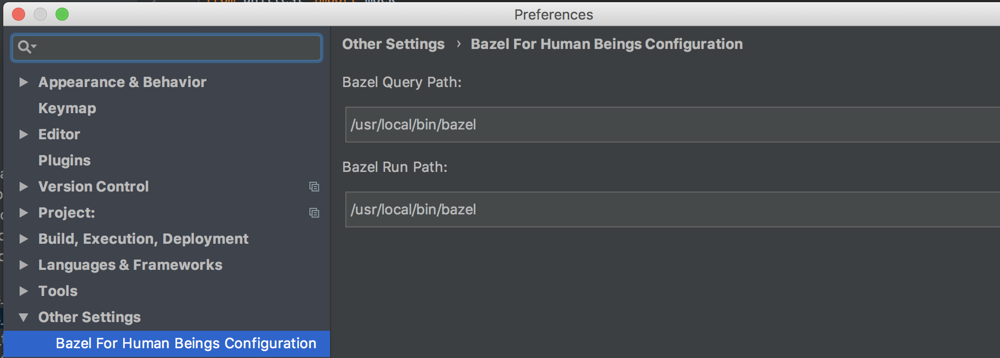
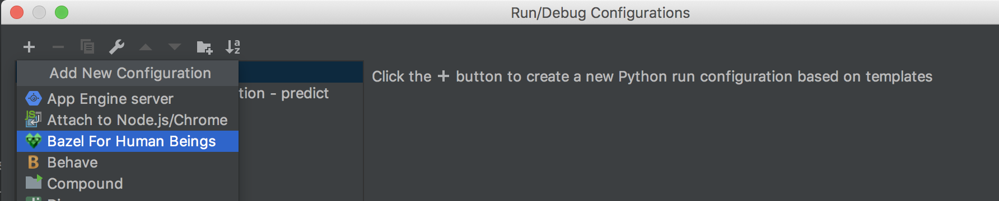
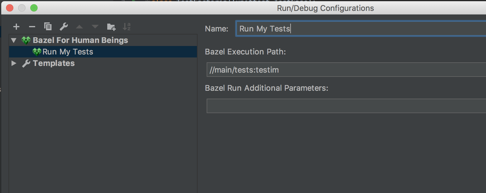
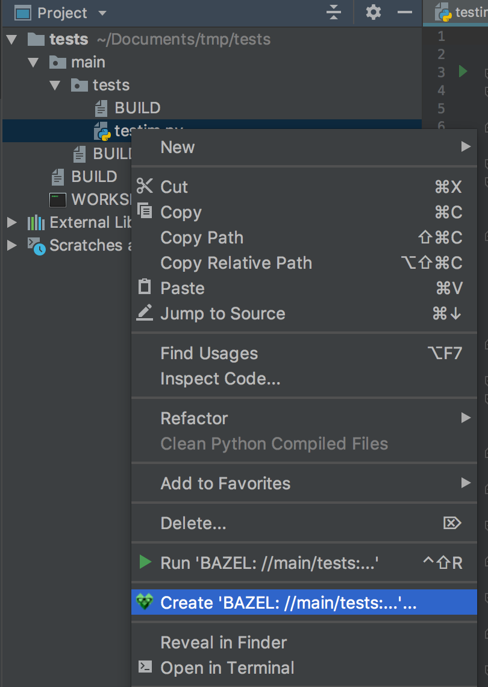
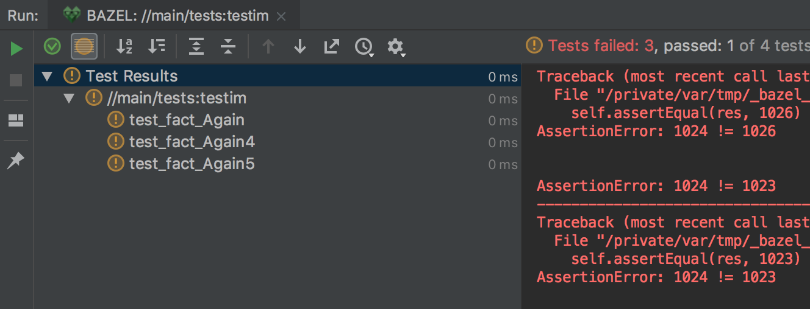

# Bazel For Human Beings
Bazel lightweight plugin for PyCharm


## Usage
### TL;DR
Configure the bazel path in ```Preferences -> Bazel For Human Beings Configuration```


Add new Bazel For Human Beings run configuration with the bazel rule or 
simply right click on a code file and Bazel For Human Beings will find the correct bazel rule for you

That's it now you can run bazel tasks from inside PyCharm!

### In Depth
#### Bazel Executable path

Configure the bazel executable path in ```Preferences -> Bazel For Human Beings Configuration```



As you can see above, there are two text boxes, one for the bazel query, and one for the bazel run.

Bazel for Human Beings is using bazel query command in order to get metadata on your run - 
for example derive the bazel rule type automatically, or suggest bazel rule based on the python file.

In this screen you can specify different bazel executable for the query commands and different one for the run, build and test commands.
The main purpose of this separation is to enable the usage of third party bazel run wrappers like [Dazel](https://github.com/nadirizr/dazel);

#### Bazel for Human Beings Run Configuration

After you install the plugin, you will receive new run configuration option: Bazel For Human Beings.



Select it to create new Bazel For Human Beings run configuration.



In the bazel execution path text box, enter the path to your rule.
 
The next text box is optional, and let you pass comma separated list of parameters to the bazel run command.

Save the run configuration, and you are good to go!

#### Create Run Configuration from context menu

We are human beings, and we don't remember the bazel rule path for each and every task.
Not to worry, Bazel for Human Beings creates new run configuration for you!

Simply right click on your code file, and select "Create Bazel ..." and the run configuration will be created for you!



You can also user the "Run 'Bazel: ..." in order to create new run configuration and execute it.

#### Execute your Bazel For Human Beings Configuration

After you create new run configuration, now its the time to execute it - select your configuration and click run.
You probably noticed that you haven't selected the bazel action, 
That's because Bazel For Human Beings automatically derive the bazel action required for this python bazel rule.

So just run the configuration and Bazel For Human Beings will show you the test browser, if this is test action, 
or simple console window for build, and run.




## Build

Using gradle jar task

## Version Support

PyCharm 2018.3
